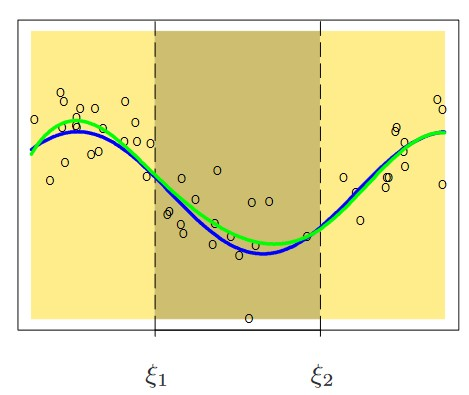

```{r setup, include=FALSE}
knitr::opts_chunk$set(echo = FALSE)

library(ggplot2)
library(splines)
## target knits Rmds in their own session, so load libraries here.
# source("here::here(packages.R)")
```

### Dissertation Committee
* Chair: Nengjun Yi, Ph.D.
* Member (in alphabetical order):
  * AKM Fazlur Rahman, Ph.D.
  * Byron C. Jaeger, Ph.D.
  * D. Leann Long, Ph.D.
  * Michael E. Seifert, M.D.


# Outline {.unlisted .unnumbered}

* Background
    * Spline Model Development
    * Bayesian Regularization
    * Bayesian Variable Selection
* Dissertation
    * Two-part Spike-and-slab LASSO Prior for Spline Functions
    * EM-Coordinate Descent Algorithms
    * Empirical Performance of Prediction & Selection
* Future Research
    * Structured Additive Regression with Spike-and-Slab LASSO prior
    * Spatially Variable Genes Screening
    * Other Questions of Interest

# Background

## Spline Model Development

> "It is extremely unlikely that the true (effect) function f(X) (_on the outcome_) is actually linear in X."
\hspace*{2cm}

> --- @hastie2009elements PP. 139

\begin{tcolorbox}[colback=green!5,colframe=green!40!black,title=Question]
How to model nonlinear effects?
\end{tcolorbox}


### Spline Functions

::: columns
:::: column

A _spline_ function is a piece-wise polynomial function
$$
B(x) = \sum\limits_{k = 1}^K \beta_k b_k(x) \equiv  \bs X^T \bs \beta
$$
$b_k(x)$ are the _basis functions_, possibly truncated power basis and b-spline basis. [@Wood2017] 
::::

:::: column
<!-- \centering -->
<!-- {height=60%} -->

```{r plot1, message=FALSE}

set.seed(1)

x <- seq(-1, 1, 0.01)
y <- 2*sin(7*x)+rnorm(length(x), 0, 0.5)

ggplot() +
  geom_point(aes(x, y)) +
  stat_smooth(aes(x, y, color="Linear"), method="lm", se = FALSE, size = 2) +
  stat_smooth(aes(x, y, color = "Spline"), method = "gam", se = FALSE, size = 2) +
  geom_function(fun = ~2*sin(7*.x), group = "C", size = 2, mapping = aes(color = "Data")) +
  scale_colour_manual("Functions: ",
                      values=c("Linear" = "#66c2a5","Spline" = "#8da0cb", "Data" = "#fc8d62")) +
  theme_classic()+
  theme(legend.position = "top")
```
::::
:::

* For simplicity, we assume all functions have $k$ basis functions and knots of functions are equidistance.


### Generalized Additive Models with Splines

__Generalized additive model__ [@Hastie1987] is expressed
\begin{align*}
  y_i &\simiid EF(\mu_i, \phi), \quad i = 1, \dots, n\\
  g(\mu_i) &= \beta_0 + B(x_i) = \beta_0 + \bs X_i^T \bs \beta ,  \quad \mathbb{E}\left[B(X)\right] = 0 
\end{align*}
where $B(x_i)$ is the spline function, $g(\cdot)$ is a link function, $\phi$ is the dispersion parameter

\vspace*{0.2cm}

* Model fitting follows the generalized linear models, e.g. ordinary least square for Gaussian outcome
$$
\boldsymbol{\hat \beta} = \text{arg}\min \sum\limits^n_{i=1} \left[y_i - \beta_0 - \bs X_i^T \bs \beta \right]^2
$$

### Problem: Function Smoothness

<!-- The estimation of $B(X)$ can be wiggly when the underlying function is smooth, particularly as the number of bases ,$K$, increases.  -->
```{r spline_overfitting, fig.height=2.5}
mdl_10 <- lm(y ~ bs(x, df = 10))
mdl_30 <- lm(y ~ bs(x, df = 30))
mdl_50 <- lm(y ~ bs(x, df = 50))
ggplot() +
  geom_point(aes(x = x, y = y)) +
  geom_line(aes(x = x, y = predict(mdl_10,data.frame(x)), color = "10"), size = 1, alpha = 0.8) +
  geom_line(aes(x = x, y = predict(mdl_30,data.frame(x)), color = "30"), size = 1, alpha = 0.8) +
  geom_line(aes(x = x, y = predict(mdl_50,data.frame(x)), color = "50"), size = 1, alpha = 0.8) +
  theme_classic() +
  scale_colour_manual("K = ",
                      values=c("10" = "#66c2a5","30" = "#8da0cb", "50" = "#fc8d62")) +
theme(legend.position = "top")
```

\begin{tcolorbox}[colback=green!5,colframe=green!40!black,title=Question]
How to balance function complexity and signal smoothness?
\end{tcolorbox}

## Bayesian Regularization

### Smoothing Spline Model

* Smoothing penalty $\lambda \int B^{''}(X)^2dx = \lambda \bs \beta^T \bs S \bs\beta$
  * The smoothing penalty matrix $\bs S$ is known given $\bs X$
  * $\bs S$ is symmetric and positive semi-definite

* Penalized Least Square for Gaussian Outcome
$$
\boldsymbol{\hat \beta} = \text{arg}\min \sum\limits^n_{i=1} \sum\limits^n_{i=1} \left[y_i - \beta_0 - \bs X_i^T \bs \beta \right]^2 + \lambda \bs \beta^T \bs S \bs\beta
$$

* The smoothing parameter $\lambda$ is a tuning parameter, selected via cross-validation

### Problem: Multiple Predictor Model

When a model contains multiple spline functions for variables $X_1, \dots, X_p$, the penalized least square estimator is
$$
\boldsymbol{\hat \beta} = \text{arg}\min \sum\limits^n_{i=1}  \left[y_i - \beta_0 - \sum\limits_{j=1}^p \bs X_{ij}^T \bs \beta_j \right]^2 + \sum\limits_{j=1}^p\lambda_j \bs \beta_j^T \bs S_j \bs\beta_j
$$

\begin{tcolorbox}[colback=green!5,colframe=green!40!black,title=Question]
How to choose $\lambda_i$ for $i = 1, \dots, p$?
  \begin{itemize}
    \item Global smoothing: $\lambda_1 = \cdots =\lambda_p$
    \item Adaptive smoothing: unique $\lambda_i$ for $i = 1, \dots, p$
  \end{itemize}
\end{tcolorbox}

### Bayesian Regularization

* Bayesian Regularization is the Bayesian analogy of penalized models by using regularizing priors
  * Bayesian ridge via normal prior
  $$
   \beta \sim N(0, \tau^2) \rightarrow  \lambda = \sigma^2/\tau^2
  $$
  
* Adaptive shrinkage with hierarchical priors
  $$
   \tau^2_j \simiid IG(a, b)
  $$
  * Adaptive Smoothing
    * Random walk prior on b-spline bases with IG hyperprior
    * Normal prior on truncated power bases with a log-normal spline model for variance

## Bayesian Variable Selection
### Problem: Functional Selection
In the context of variable selection and high-dimensional statistics, we always assume some variables are not effective or predictive of the outcome.

\begin{tcolorbox}[colback=green!5,colframe=green!40!black,title=Question]
How to statistically detect
  \begin{itemize}
    \item if a variable is predictive to the outcome, $B_j(X_j) = 0$
    \item if a variable has a nonlinear relationship with the outcome, $B_j(X_j) = \beta_j X_j$
  \end{itemize}
\end{tcolorbox}

_Bi-level selection_ is the procedure that simultaneously addresses the two questions above


### Spike-and-Slab Priors
Spike-and-slab priors are a family of mixture distributions that deploys a characterizing structure
  $$\beta|\gamma \sim (1-\gamma)f_{spike}(\beta) + \gamma f_{slab}(\beta)$$

  * Latent indicator $\gamma$ follows a Bernoulli distribution with probability $\theta$
  * Spike density $f_{spike}(x)$ concentrates around 0 for small effects
  * Slab density $f_{slab}(x)$ is a flat density for large effects
  
* Natural procedure to select variables via posterior distribution of $\gamma$
* Markov chain Monte Carlo is not compelling for high-dimensional data analysis

### Spike-and-Slab LASSO Priors
* Double exponential distributions as the spike and slab distributions
  $$\beta|\gamma \sim (1-\gamma)DE(0, s_0) + \gamma DE(0, s_1), 0 < s_0 < s_1$$
  * Seamless variable selection as coefficients shrinkage to 0
  * Computation advantages via Expectation-Maximization (EM) algorithms
  
* Group spike-and-slab LASSO
  * Structure underlying predictors, e.g. gene pathways, bases of a spline function
  * Structured prior on $\gamma$
  $$
  \gamma_k | \theta_j ~ Binomial(1, \theta_j), k \in j
  $$

### Problem: High-dimensional Spline Model

\begin{tcolorbox}[colback=green!5,colframe=green!40!black,title=Question]
How to jointly model signal sparsity and function smoothness, while capable of bi-level selection?
\end{tcolorbox}

* Excess shrinkage due to ignoring smooth penalty completely
    * Group lasso penalty [@Ravikumar2009; @Huang2010], group SCAD penalty [@Wang2007; @Xue2009]
    * Global penalty VS adaptive penalty

* All-in-all-out selection
    * Can not detect if a function is linear, e.g. spike-and-slab grouped LASSO prior [@Bai2020; @Bai2021]
    * Failed to select function as whole, e.g. group spike-and-slab LASSO prior

# Dissertation

### Objectives
* To develop statistical models that improve curve interpolation and outcome prediction
  * Local adaption of sparse penalty and smooth penalty
  * Bi-level selection for linear and nonlinear effect
* To develop a fast and scalable algorithm
* To implement a user-friendly statistical software

### Projects

* \textbf{Guo, B.}, Jaeger, B. C., Rahman, A. F., Long, D. L., Yi, N. (2022). Spike-and-Slab least absolute shrinkage and selection operator generalized additive models and scalable algorithms for high-dimensional data analysis. _Statistics in Medicine_. doi: \url{https://doi.org/10.1002/sim.9483}


* \textbf{Guo, B.}, Jaeger, B. C., Rahman, A. F., Long, D. L., Yi, N. (2022). A scalable and flexible Cox proportional hazard model for high-dimensional survival prediction and functional selection _arXiv_. doi: \url{https://doi.org/10.48550/arXiv.2205.11600}


* \textbf{Guo, B.}, Yi, N. (2022). `BHAM`: An R Package to Fit Bayesian Hierarchical Additive Models for High-dimensional Data Analysis _Work in Progress_

## Two-part Spike-and-slab LASSO (SSL) Prior for Smooth Functions
### Generalized Additive Model
Given the data $\{y_i, x_{i1}, \dots ,x_{ip}\}_{i=1}^n$ where $p >> n$
\begin{align*}
y_i &\overset{\text{i.i.d.}}{\sim} EF(\mu_i, \phi),\\
g(\mu_i) &= \beta_0 + \sum\limits^p_{j=1}B_j(x_{ij}) , \quad i = 1, \dots, n.
\end{align*}


### Smoothing Function Reparameterization
* Smoothing penalty from Smoothing spline regression [@Wood2017]
$$
\lambda_j \int B^{\prime\prime}_j(x)dx = \lambda_j \bs \beta_j^T \bs S_j \bs \beta_j,
$$
where $S_j$ is a known smoothing penalty matrix.

* Isolate the linear and nonlinear components via eigendecomposing $S_j$
  <!-- * $\bm S = \bm U \bm D \bm U^T$ -->
  <!-- * $\bm U \equiv [\bm U^\tp : \bm U^0]$ and $\bm D \equiv [\bm D^\tp : \bm 0]$ -->
   $$\bm X \bm \beta = X^{0} \beta + \bs X^\tp\beta^\tp$$

* Benefits
  * Motivate bi-level selection
  * Implicit modeling of function smoothness
  * Reduce computation load with conditionally independent prior of basis coefficients 

### Two-part Spike-and-slab LASSO (SSL) Prior

* SSL prior for the linear coefficient and group SSL priors for nonlinear coefficients
\begin{align*}
\beta_{j} |\gamma_{j},s_0,s_1 &\sim DE(0,(1-\gamma_{j}) s_0 + \gamma_{j} s_1) \\
\beta^\tp_{jk} | \gamma^\tp_{j},s_0,s_1 &\simiid DE(0,(1-\gamma^\tp_{j}) s_0 + \gamma^\tp_{j} s_1), k = 1, \dots, K_j
\end{align*}
* Effect hierarchy enforced latent inclusion indicators $\gamma_j$ and $\gamma^\tp_{j}$ for bi-level selection
$$
\gamma_{j} | \theta_j \sim Bin(\gamma_{j}|1, \theta_j),\quad
\gamma_{j}^\tp | \bg{\gamma_{j}}, \theta_j \sim Bin(1, \bg{\gamma_{j}}\theta_j),
$$
* Local adaptivity of signal sparsity and function smoothness
$$
\theta_j \sim \text{Beta}(a,b)
$$

### Visual Representation
\begin{figure}
\centering
\resizebox{12cm}{5.5cm}{
\begin{tikzpicture} [
staticCompo/.style = {rectangle, minimum width=1cm, minimum height=1cm,text centered, draw=black, fill=blue!30},
outCome/.style={ellipse, minimum width=3cm, minimum height=1cm,text centered, draw=black, fill=blue!30},
mymatrix/.style={matrix of nodes, nodes=outCome, row sep=1em},
PriorBoarder/.style={rectangle, minimum width=5cm, minimum height=10cm, text centered, fill=lightgray!30},
background/.style={rectangle, fill=gray!10,inner sep=0.2cm, rounded corners=5mm}
]

\matrix (linearPrior) [matrix of nodes, column sep = 0mm, row sep = 0.7cm] {
  \node (linearGamma) [outCome] { $\gamma_j \sim Bin(1, \theta_j) $ };\\
  \node (linearBeta) [outCome] { $\beta_j \sim DE(0,(1-\gamma_{j}) s_0 + \gamma_{j} s_1)$};\\
};
\matrix (penPrior) [right = 2cm of linearPrior, matrix of nodes, column sep = 0mm, row sep = 0.7cm] {
  \node (penGamma) [outCome] { $\gamma_{j}^\tp \sim Bin(1, \bg{\gamma_{j}}\theta_j)$ };\\
  \node (penBeta) [outCome] { $\beta_{jk}^\tp \sim  DE(0,(1-\gamma^\tp_{j}) s_0 + \gamma^\tp_{j} s_1)$};\\
};


\node (s) [staticCompo]  at ($(linearBeta)!0.5!(penBeta)$)  {($s_0, s_1$)};
\node (Beta) [staticCompo, below = 1cm of s] {$\bs \beta = (\beta_1, \bs \beta^\tp_1, \dots,\beta_j, \bs \beta^\tp_j , \dots,\beta_p, \bs \beta^\tp_p) $};
\node (Theta)[outCome, above = 2cm of s] {$\theta_{j} \sim Beta(a, b)$};
\node (ab)[staticCompo, above = 0.5cm of Theta] {$(a, b)$};
\node (Y) [outCome, below = 1cm of Beta] {$y_i \sim Expo. Fam. (g^{-1}(\bs \beta^T \bs X_i), \phi)$};

\draw[->] (Theta) -- (linearGamma);
\draw[->] (Theta) -- (penGamma);
\draw[->] (linearGamma) -- (linearBeta) ;
\draw[->] (penGamma) -- (penBeta);
\draw[->, draw = red] (linearGamma) -- (penGamma);
\draw[->] (ab) -- (Theta);
\draw[->] (s) -- (linearBeta) ;
\draw[->] (s) -- (penBeta);
\draw[->] (linearBeta) -- (Beta);
\draw[->] (penBeta) -- (Beta);
\draw[->] (Beta) --  (Y);


\begin{pgfonlayer}{background}
  \node [background,
   fit=(linearGamma) (linearBeta),
   label=above:Linear Space:] {};
  \node [background,
    fit=(penGamma) (penBeta),
    label=above:Nonlinear Space:] {};
\end{pgfonlayer}

\end{tikzpicture}
}
\end{figure}

### EM-Cooridante Descent Algrithm for Scalable Model Fitting

We are interested in estimating $\Theta = \{\bm \beta, \bm \theta, \phi\}$ using optimization based algorithm for scalability purpose

* Basic Ideas
  * Treat $\gamma$s as the "missing data" in the EM procedure
  * Quantify the expectation of log posterior density function of $\Theta$ with respect to $\gamma$ conditioning on $\Theta^{(t-1)}$
  * Maximize two  parts of the objective function independently
  
* Previous applications in high-dimensional data analysis
  * EMVS [@Rockova2014a], Spike-and-slab lasso [@Rockova2018]
  * BhGLM [@Yi2019]


### Decomposition of Objective Function
We aim to maximize the log posterior density of $\Theta$ by averaging over all possible values of $\bm \gamma$
$$ \log f(\Theta, \bs \gamma| \textbf{y}, \textbf{X}) = Q_1(\bs \beta, \phi) + Q_2 (\bs \gamma,\bs \theta),$$

* L$_1$-penalized likelihood function of $\bs \beta, \phi$
$$Q_1 \equiv Q_1(\bs \beta, \phi) = \log f(\textbf{y}|\bs \beta, \phi) + \sum\limits_{j=1}^p\left[\log f(\beta_j|\gamma_j)+\sum\limits_{k=1}^{K_j} \log f(\beta^{\tp}_{jk}|\gamma^{\tp}_{jk})\right]$$
* Posterior density of $\theta$ given data points $\gamma$s
$$Q_2 \equiv Q_2(\bs\gamma,\bs\theta) = \sum\limits_{j=1}^{p} \left[ (\gamma_j+\gamma_{j}^{\tp})\log \theta_j + (2-\gamma_j-\gamma_{j}^{\tp}) \log (1-\theta_j)\right] +  \sum\limits_{j=1}^{p}\log f(\theta_j).$$

* $Q_1$ and $Q_2$ are independent conditioning on $\gamma$s


### Summary of EM-Coordinate Descent Algorithm
* E-step
  * Formulate $E_{\bm \gamma|\Theta^{(t)}}\left[Q(\Theta, \bm \gamma)\right] = E(Q_1) + E(Q_2)$
    * $E(Q_1)$ is a penalized likelihood function of $\beta, \phi$
    * $E(Q_2)$ is a posterior density of $\theta$ given $E(\gamma)$
    * $E(Q_1)$ and $E(Q_2)$ are conditionally independent
  * Calculate $E(\gamma_{j})$, $E(\gamma^\tp_{j})$ and the penalties parameters by Bayes' theorem
* M-step: 
  * Use Coordinate Descent to fit the penalized model in $E(Q_1)$ to update $\beta, \phi$ 
  * Closed form calculation via $E(Q_2)$ to update $\theta$

### Tuning Parameter Selection
* $s_0$ and $s_1$ are tuning parameters
* Empirically, $s_1$ has extremely small effect on changing the estimates
* Focus on tuning $s_0$
* Consider a sequence of $L$ ordered values $\{s_0^l\}: 0 < s_0^1 < s_0^2 < \dots < s_0^L < s_1$
* Cross-validation to choose optimal value for $s_0$


### Simulation Study
* Follow the data generating process introduced in @Bai2020. 
* $n_{train} = 500$, $n_{test}=1000$
* $p=4, 10, 50, 200$
$$
\mu = 5 \sin(2\pi x_1) - 4 \cos(2\pi x_2 -0.5) + 6(x_3-0.5) - 5(x_4^2 -0.3),
$$

* $f_j(x_j) = 0$ for $j = 5, \dots, p$.
* 2 types of outcome: Gaussian ($\phi=1$), Binomial
* Splines are constructed using 10 knots
* 50 Iterations

### Comparison & Metircs
* Methods of comparison
  * Proposed model BHAM
  * Linear LASSO model as the benchmark
  * mgcv [@Wood2004]
  * COSSO [@Zhang2006GAM] and adaptive COSSO[@Storlie2011]
  * Sparse Bayesian GAM [@Bai2021]
  * spikeSlabGAM [@Scheipl2012]

* Metrics
  * Prediction: $R^2$ for continuous outcomes, out-of-sample AUC for binary outcomes
  * Variable Selection: positive predictive value (precision), true positive rate (recall), and Matthews correlation coefficient (MCC)
  
### Prediction Performance

* Linear LASSO Model performs bad and mgcv performs well
* BHAM performs better than COSSO, adaptive COSSO and spikeSlabGAM
* BHAM performs better than SB-GAM in low-dimensional case but slightly worse in the high-dimensional setting
* BHAM is much faster than SB-GAM in fitting models

### Variable Selection Performance
* SB-GAM has the best variable selection performance
* BHAM has conservative selection
* BHAM and spikeSlabGAM have trade-offs for bi-level selection
  * spikeSlabGAM tends to select either linear or nonlinear components of the function
  * BHAM is more likely to select both parts

## Additive Cox Proportional Hazards Model

### Model & Objective Functions
* Cox proportional hazard model with event time $t_i$
$$
  h(t_i) = h_0(t_i)\exp(\sum\limits^p_{j=1}B_j(x_{ij})) , \quad i = 1, \dots, n.
$$
  * No intercept term because of the baseline hazard function
* Model fitting
  * Replace likelihood function with partial likelihood function
$$
\hat h_0(t_i|\beta) = d_i/\sum\limits_{i^\prime \in R(t_i)} exp(X_{i^\prime}\beta).
$$

### Two-part Spike-and-slab LASSO (SSL) Prior

* SSL prior for the linear coefficient and group SSL priors for nonlinear coefficients
\begin{align*}
\beta_{j} |\gamma_{j},s_0,s_1 &\sim DE(0,(1-\gamma_{j}) s_0 + \gamma_{j} s_1) \\
\beta^\tp_{jk} | \gamma^\tp_{j},s_0,s_1 &\simiid DE(0,(1-\gamma^\tp_{j}) s_0 + \gamma^\tp_{j} s_1), k = 1, \dots, K_j
\end{align*}
* Effect hierarchy enforced latent inclusion indicators $\gamma_j$ and $\gamma^\tp_{j}$ for bi-level selection
$$
\gamma_{j} | \theta_j \sim Bin(\gamma_{j}|1, \theta_j),\quad
\gamma_{j}^\tp | \bg{\gamma_{j}}, \theta_j \sim Bin(1, \bg{\gamma_{j}}\theta_j),
$$
* Local adaptivity of signal sparsity and function smoothness
$$
\theta_j \sim \text{Beta}(a,b)
$$

### Summary of EM-Coordinate Descent Algorithm
* E-step
  * Formulate $E_{\bm \gamma|\Theta^{(t)}}\left[Q(\Theta, \bm \gamma)\right] = E(Q_1) + E(Q_2)$
    * $E(Q_1)$ is a penalized likelihood function of $\beta, \phi$
    * $E(Q_2)$ is a posterior density of $\theta$ given $E(\gamma)$
    * $E(Q_1)$ and $E(Q_2)$ are conditionally independent
  * Calculate $E(\gamma_{j})$, $E(\gamma^\tp_{j})$ and the penalties parameters by Bayes' theorem
* M-step: 
  * Use Coordinate Descent to fit the penalized model in $E(Q_1)$ to update $\beta, \phi$ 
  * Closed form calculation via $E(Q_2)$ to update $\theta$

### Simulation Study
* Follow the data generating process introduced in @Bai2020. 
* $n_{train} = 500$, $n_{test}=1000$
* $p=4, 10, 50, 200$
$$
\mu = 5 \sin(2\pi x_1) - 4 \cos(2\pi x_2 -0.5) + 6(x_3-0.5) - 5(x_4^2 -0.3),
$$

* $f_j(x_j) = 0$ for $j = 5, \dots, p$.
* 2 types of outcome: Gaussian ($\phi=1$), Binomial
* Splines are constructed using 10 knots
* 50 Iterations

### Comparison & Metircs
* Methods of comparison
  * Proposed model BHAM
  * Linear LASSO model as the benchmark
  * mgcv [@Wood2004]
  * COSSO [@Zhang2006GAM] and adaptive COSSO[@Storlie2011]

* Metrics
  * Out-of-sample deviance & Concordance
  * Variable Selection: positive predictive value (precision), true positive rate (recall), and Matthews correlation coefficient (MCC)
  
### Prediction Performance

* Linear LASSO Model performs bad and mgcv performs well
* BHAM performs better than COSSO, adaptive COSSO and spikeSlabGAM

### Emipirical Performance: Emory Cardiovascular Biobank

{height=60%}

## R Package `BHAM`
  - Model formulation for high-dimensional data
  - Model fitting and tuning
  - Model summary and variable selection
  - Spline function visualization 
  - Website via [_boyiguo1.github.io/BHAM_](https://boyiguo1.github.io/BHAM/)
  
### Design Matrix of Spline Fucntions
  - Flexible spline function formulation for high-dimensional data
  ```{r echo = T, eval= F}
  spline_df <- dplyr::tribble(
      ~Var, ~Func, ~Args,
      "X1",  "s", "bs='cr', k=5",
      "X2",  "s", NA,
      "X3",  "s", "")
  spline_df <- data.frame(
      Var = setdiff(names(dat), "y"),
      Func = "s",
      Args ="bs='cr', k=7")
  train_sm_dat <- BHAM::construct_smooth_data(spline_df, dat)
  ```

### Model Fitting Functions
  - Model fitting via `bamlasso`
    - Argument `family` for generalized and survival outcomes
    - Argument `ss` for spike-and-slab LASSO scale parameters
    - Argument `group` for group structures among predictors
  - Model tuning via `tune`
    - Argument `nfolds`, `ncv` for nested cross-validation
    - Argument `s0` for tuning candidates

### Post Fitting Functions
  - Bi-level selection via `bamlasso_var_selection`
  - Make prediction data for splines `make_predict_dat`
  - Plot spline functions via `plot_smooth_term`

# Future Research

## Modeling Interactions
### Varying coefficient models 
  * Assume the coefficient of a variable $X_j$ is a function of a covariate $Z_j$
    * linear model: $\beta(Z_j) = \beta$
    * VC model: $\beta(Z_j) = B(Z_j)$
  * Replace each smooth function $B(z_{ij})$ with $B(z_{ij})x_{ij}\equiv \bs (x_{ij}\bs Z_{ij}^T)\bs \beta_j$
  * Model fitting with EM-Coordinate Descent
  
Question: 

\begin{tcolorbox}[colback=green!5,colframe=green!40!black,title=Question]
  Can $Z_j$ be continuous? Is it possible to have a more flexible model? 
\end{tcolorbox}

### Smooth Surface Fitting
* Tensor product of spline functions
  $$
    B_j(x_{ij}) + B_s(x_{is}) + B_{js}(x_{ij}, x_{is}),
  $$
where 
$$
B_{js}(x_{ij}, x_{is}) = \sum\limits^K_{P\rho=1} \sum\limits^K_{v=1} \beta_{jspv} b_{j\rho}(x_{ij})b_{sv}(x_{is})
$$

\begin{tcolorbox}[colback=green!5,colframe=green!40!black,title=Question]
  Can we have a generalized model that accounts fixed effects, nonlinear curves, smooth surfaces, and random effects?
\end{tcolorbox}

### Structural Additive Model
High-dimensional structural additive model can be formulated as
$$
g(\mathbb{E}(y_i)) = \bs x_i^T \bs \theta + \bs u_i^T \bs \gamma + B(z_{i1}) + B(z_{i2}, z_{i3}) + B_{spat}(s_i)
$$

* Un-regularized predictors $\bs x_i$
* Regularized predictors $\bs u_i$
* Predictors with nonlinear effects $\bs z_i$
* Spatial random effects with coordinates $s_i$

Spike-and-slab LASSO prior motivates a seamless process of variable/functional selection and a scalable optimization-based model fitting algorithm

# Conclusion 

* Identify challenges in high-dimensional GAM with spline functions
  * Balance between signal sparsity and function smoothness
  * Bi-level selection to automatically detect linear and nonlinear effects
* Statistical contribution
  * Two-part spike-and-slab LASSO prior for smooth functions
  * Scalable EM-Coordinate Descent algorithms for generalized and survival outcomes
  * R package `BHAM`
* Future Research
  * Extension of spike-and-slab LASSO prior in structured additive model

<!-- ## Acknowledgement -->
<!-- -a -->
<!-- -b -->
<!-- -c -->

<!-- ## Advocacy -->
<!-- -a -->
<!-- -b -->
<!-- -c -->

# References {.allowframebreaks}
